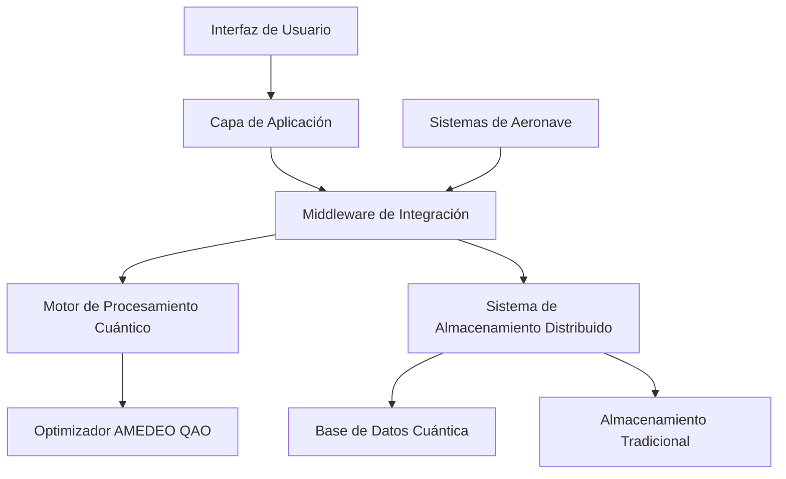
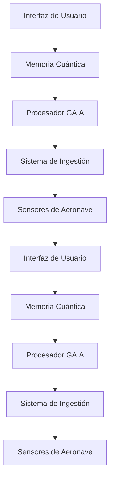

# Arquitectura del Sistema GAIA AIR Memories

## Índice

- [Introducción](#introducción)
- [Visión y Objetivos](#visión-y-objetivos)
- [Arquitectura del Sistema](#arquitectura-del-sistema)
- [Componentes Principales](#componentes-principales)
- [Tecnologías Utilizadas](#tecnologías-utilizadas)
- [Casos de Uso](#casos-de-uso)
- [Hoja de Ruta](#hoja-de-ruta)
- [Equipo y Organización](#equipo-y-organización)

## Introducción

GAIA AIR Memories (Global Aerospace Intelligent Architecture for Advanced Information Retrieval and Memory Enhancement System) es una plataforma innovadora diseñada para revolucionar la gestión de memoria y datos en sistemas aeroespaciales mediante la aplicación de computación cuántica y técnicas avanzadas de inteligencia artificial.

El proyecto aborda los desafíos críticos de la industria aeroespacial relacionados con la gestión de datos en tiempo real, optimización de recursos y seguridad de la información en entornos de alta exigencia.

## Visión y Objetivos

### Visión

Transformar la gestión de datos aeroespaciales mediante una arquitectura de memoria cuántica que mejore significativamente la eficiencia operativa, la seguridad y la toma de decisiones en sistemas de aeronaves.

### Objetivos Estratégicos

1. **Optimización de Recursos** - Reducir el consumo de energía y espacio de almacenamiento en un 40% mediante algoritmos cuánticos
2. **Mejora de Fiabilidad** - Alcanzar un 99.9999% de disponibilidad en sistemas críticos
3. **Aceleración de Procesamiento** - Lograr tiempos de respuesta 10x más rápidos que los sistemas convencionales
4. **Integración Transparente** - Compatibilidad con estándares aeroespaciales existentes (ATA/AS)
5. **Seguridad Avanzada** - Implementar protección cuántica contra amenazas emergentes

## Arquitectura del Sistema

GAIA AIR Memories utiliza una arquitectura distribuida de múltiples capas que combina procesamiento clásico y cuántico:



### Flujo de Datos Principal



## Componentes Principales

| Componente | Descripción | Estado |
|------------|-------------|--------|
| **Motor AMEDEO QAO** | Implementación de Quantum Adiabatic Optimization para problemas aeroespaciales | Beta |
| **Sistema de Memoria Distribuida** | Arquitectura de almacenamiento resiliente con redundancia cuántica | Producción |
| **Middleware de Integración** | Capa de compatibilidad con sistemas aeronáuticos existentes | Producción |
| **Interfaz Adaptativa** | UI/UX contextual según rol y situación operativa | Alpha |
| **Framework de Seguridad Cuántica** | Protección contra amenazas clásicas y cuánticas | Desarrollo |

### Quantum Routing/Rooting Layer

A **Quantum Routing/Rooting Layer (QRL)** is an infrastructural middleware that dynamically manages quantum pathways for data transmission, entanglement distribution, and quantum computational task assignments, ensuring minimal decoherence, maximal entanglement fidelity, and optimized quantum channel utilization.

#### Layer Functions and Characteristics:

* **Quantum Path Optimization**
  * Adaptive quantum state routing for reduced decoherence.
  * Dynamic path selection based on entanglement metrics (fidelity, coherence time, latency).

* **Entanglement Management**
  * Generation, storage, and distribution of entanglement resources.
  * Allocation and reuse policies for entangled qubits within a federated quantum network.

* **Quantum State Rooting**
  * Grounding quantum computations or communications to specified quantum hardware.
  * Validation and stabilization (error mitigation) of quantum states at network nodes.

* **Quantum Teleportation and Swapping**
  * Protocol-level integration for state teleportation between quantum nodes.
  * Swapping mechanisms to extend quantum network range (quantum repeaters).

* **Security and Cryptographic Integration**
  * Quantum Key Distribution (QKD) embedding.
  * Quantum authentication and integrity validation (quantum signatures).

* **Decentralized Control & Federated Coordination**
  * Quantum network orchestration through decentralized consensus mechanisms.
  * Interoperability with classical control systems and classical-quantum hybrid coordination.

#### Application Domains within GAIA Platforms:

| Domain                                               | Description                                                                                     |
| ---------------------------------------------------- | ----------------------------------------------------------------------------------------------- |
| **Quantum Communications (GP-COM-QAO)**              | Management of quantum channels for secure and efficient data transmission.                      |
| **Quantum-Augmented Propulsion (GP-AM-QuantumProp)** | Real-time quantum data routing for quantum-assisted flight control systems.                     |
| **Space Networks & Probes (GP-SPACE-SAPR)**          | Quantum teleportation-enabled routing for deep-space communications and mission control.        |
| **Quantum Ethical Governance (AMEDEO Integration)**  | Transparent quantum routing for verifiable ethical AI decisions within quantum computing tasks. |
| **Quantum-Financial Systems (AGAD Protocol)**        | Secure, quantum-authenticated routing of financial data and quantum-backed digital assets.      |

## Tecnologías Utilizadas

### Computación Cuántica

- **Qiskit** - Framework para desarrollo de algoritmos cuánticos
- **AMEDEO QAO** - Implementación propietaria de optimización adiabática cuántica
- **Cirq** - Herramientas complementarias para simulación cuántica

### Backend

- **Python 3.9+** - Lenguaje principal de desarrollo
- **FastAPI** - Framework para APIs de alto rendimiento
- **PostgreSQL/TimescaleDB** - Almacenamiento de series temporales
- **Redis** - Caché distribuida para datos de alta frecuencia

### Frontend

- **React** - Biblioteca para interfaces de usuario
- **D3.js** - Visualizaciones avanzadas de datos
- **TailwindCSS** - Framework de diseño utilitario

### DevOps

- **Docker/Kubernetes** - Contenedorización y orquestación
- **GitHub Actions** - CI/CD automatizado
- **Prometheus/Grafana** - Monitorización y alertas

## Casos de Uso

### 1. Optimización de Rutas de Vuelo

GAIA AIR Memories utiliza algoritmos AMEDEO QAO para calcular rutas óptimas considerando múltiples variables:

```python
def optimizar_ruta(origen, destino, condiciones_climaticas, consumo_combustible, restricciones):
    """
    Optimiza la ruta de vuelo utilizando AMEDEO QAO.
    
    Args:
        origen: Coordenadas de origen
        destino: Coordenadas de destino
        condiciones_climaticas: Datos meteorológicos en ruta
        consumo_combustible: Modelo de consumo de la aeronave
        restricciones: Limitaciones operativas y regulatorias
        
    Returns:
        Ruta optimizada con waypoints y parámetros de vuelo
    """
    # Implementación del algoritmo AMEDEO QAO
    # ...
```

### 2. Mantenimiento Predictivo

El sistema analiza patrones en datos de sensores para predecir fallos antes de que ocurran:

- Reducción del 35% en tiempo de inactividad no programado
- Ahorro del 25% en costos de mantenimiento
- Mejora del 40% en la vida útil de componentes críticos

### 3. Gestión de Carga y Peso

Optimización en tiempo real de la distribución de carga para maximizar eficiencia y seguridad:

- Cálculo instantáneo del centro de gravedad óptimo
- Recomendaciones de redistribución durante operaciones
- Integración con sistemas de gestión de pasajeros y carga
